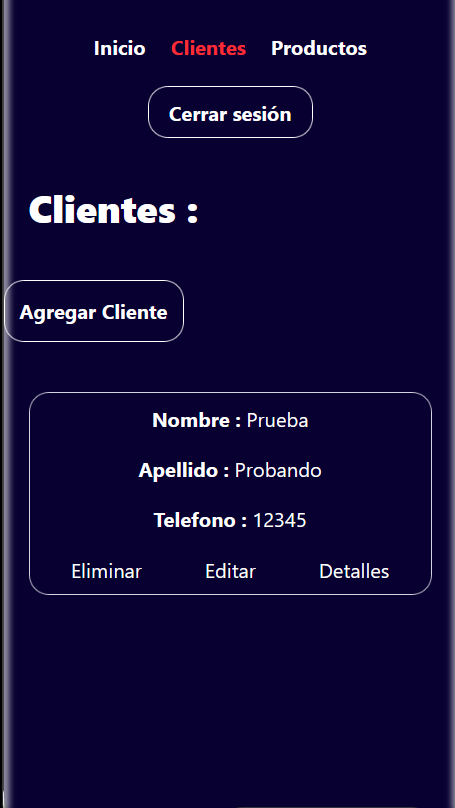
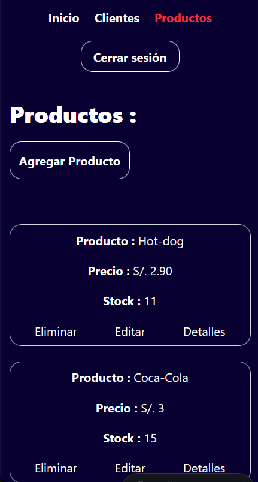
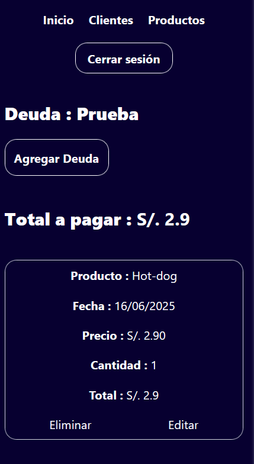

# 🛒 Bodega Firebase

Este proyecto es una aplicación web desarrollada para gestionar los productos y ventas de una **bodega real** de forma práctica, rápida y accesible desde cualquier dispositivo. Está pensada para ayudar a llevar un mejor control de los productos vendidos y los ingresos diarios, de forma digital.

## 🌐 App en producción

👉 Visita la app en: [https://jhoanbodega.netlify.app](https://jhoanbodega.netlify.app)

## 🚀 Tecnologías utilizadas

- ⚡ [Astro](https://astro.build/) — Framework moderno para sitios rápidos y eficientes.
- ⚛️ React — Para los componentes interactivos y formularios dinámicos.
- 🌐 Firebase — Backend en tiempo real para almacenar clientes, productos y detalles de ventas.
- 💨 Tailwind CSS — Framework de estilos para construir una interfaz atractiva y responsive.
- ☁️ Netlify — Plataforma de despliegue continuo y hosting del sitio web.

## 🧩 Funcionalidades principales

- ✅ Registro de **clientes** (nombre, apellido, teléfono).
- ✅ Gestión de **productos** (nombre y precio).
- ✅ Agregar **detalles de venta** asociados a un cliente (producto, precio, cantidad, total, fecha).
- ✅ Edición y eliminación de ventas y clientes.
- ✅ Cálculo automático del **total** por venta.
- ✅ Visualización de los registros en **tablas adaptadas** para escritorio y móviles.
- ✅ Almacenamiento persistente de datos en la nube mediante Firebase.

## 📸 Capturas del sistema

### 🏠 Página principal


### 👥 Gestión de clientes


### 📦 Gestión de productos


### 📋 Detalles de venta



## 📂 Estructura del proyecto

```bash
/
├── src/
│   ├── components/          # Componentes React y Astro
│   ├── lib/                 # Funciones para interactuar con Firebase
│   ├── pages/               # Rutas principales del sitio
│   └── layouts/             # Plantillas base
├── public/                  # Archivos estáticos (imágenes)
├── astro.config.mjs         # Configuración de Astro
├── tailwind.config.js       # Configuración de Tailwind
├── firebase.js              # Conexión a Firebase
└── package.json             # Dependencias y scripts del proyecto
